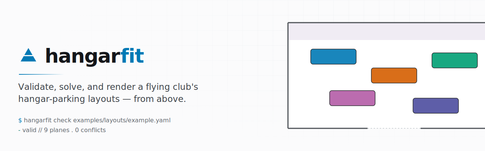

<picture>
  <source media="(prefers-color-scheme: dark)"  srcset="docs/assets/banner-dark.svg">
  <source media="(prefers-color-scheme: light)" srcset="docs/assets/banner-light.svg">
  
</picture>

# hangarfit

[](https://github.com/DocGerd/hangarfit/actions/workflows/ci.yml)
[](https://github.com/DocGerd/hangarfit/actions/workflows/codeql.yml)
[](https://codecov.io/gh/DocGerd/hangarfit)
[](https://securityscorecards.dev/viewer/?uri=github.com/DocGerd/hangarfit)
[](https://www.bestpractices.dev/projects/12987)
[](LICENSE)

An on-demand exception tool for a flying club's hangar parking.

The club parks nine aircraft in a deep, stack-style hangar with a single door at the front. There's a standard layout that works for the standard situation — every plane back from its flight at the expected time, no surprise maintenance, no late returns. When that standard situation breaks (a plane comes back late, a maintenance slot moves, two planes need to swap order), someone has to come up with an alternative parking arrangement on the spot. `hangarfit` is the tool that checks whether a proposed alternative is physically valid: no fuselage, wing, or strut collisions; everything fits inside the hangar; the plane scheduled for maintenance ends up at the back where the maintenance bay is.

It also renders a top-down PNG so a human can sanity-check the result by eye.

`hangarfit` can also *find* a layout for you: given a scenario (the fleet to park, optional pins, the maintenance plane), `hangarfit solve` searches for a valid arrangement under hard constraints. The checker remains the source of truth — every accepted layout was validated by `collisions.check()` as its acceptance gate, so the solver cannot invent a layout the checker would reject.

## Scope

**Phase 1 — shipped.** Built the substrate: aircraft + hangar data model, parts-based collision checker, matplotlib top-down visualizer, and the `hangarfit check` CLI. Phase 1 was about getting the geometry right — once the collision rule was trustworthy, the downstream solver could be built on top of it.

**Phase 2a — shipped.** Added the static layout solver: `hangarfit solve` takes a scenario YAML (fleet, hangar, constraints, optional pins) and searches for up to K diverse valid layouts using random-restart hill climbing with min-conflicts descent. Acceptance runs through `collisions.check()` as its gate — the solver does not bypass the collision rule.

**Phase 3a — shipped.** Tow-path planner v1: `hangarfit solve --render-paths` plans a per-plane tow path (Dubins) from the door to the parked pose, plus a tow order; the static-layout PNG overlays each plane's path so a human can sanity-check the route. Best-effort: a layout the planner can't fully route still renders (without paths) and a stderr warning names the blocking plane; exit code 3 fires only when no candidate layout is tow-routable. See [ADR-0007](docs/adr/0007-tow-path-planner-v1-scope.md).

**Phase 3b — shipped.** Tow-path planner v2: a Reeds–Shepp motion model (reverse arcs eliminate the reorientation loops Dubins introduced) plus a door entry-cone search over heading × offset. See [ADR-0010](docs/adr/0010-reeds-shepp-motion-model.md).

**Phase 4 — shipped.** Interactive 3D viewer: `hangarfit view` emits a self-contained, offline HTML file (vendored Three.js) showing the hangar and each aircraft as a stack of boxes — with landing gear, tow carts, soft contact shadows, kind-based materials, nose-cone arrows and id labels (both toggle from the on-page `labels` control) — plus a scrubbable whole-fill tow timeline. A "PLACEHOLDER DATA" honesty banner is shown (on both the 3D viewer and the 2D PNG) whenever any placed aircraft is on unmeasured data. Built from a documented `hangarfit.scene/v2` JSON seam; the determinant-−1 transform stays in Python (the viewer consumes per-frame affine matrices). See [ADR-0017](docs/adr/0017-3d-viewer-architecture.md).

**Still explicitly out of scope:**

- No tracking of hangar state across runs — each invocation is stateless.
- No general weighted / multi-objective optimization — the only *user-supplied* soft input is a per-plane `priority` weight ([#441](https://github.com/DocGerd/hangarfit/issues/441)) that biases the built-in inter-plane spread; pins, `force_on_carts`, and the maintenance-plane assignment remain the only inputs that can make a layout invalid. On top of `priority` the solver applies several built-in soft spatial preferences — inter-plane spread ([ADR-0008](docs/adr/0008-inter-plane-spread-soft-preference.md), default-on, toggleable with `--no-spread`), a back-of-hangar fill bias that keeps the door-side approach corridors clear ([ADR-0008 §Amendments, #320](docs/adr/0008-inter-plane-spread-soft-preference.md), default-on, toggleable with `--no-back-fill`), and a soft right/left region preference that biases placed movers (e.g. glider trailers) toward a chosen hangar wall ([#604](https://github.com/DocGerd/hangarfit/issues/604), surfaced as `region_alignment` in `solve` output) — but none of these ever overrides a hard constraint.
- No interactive editing GUI, server, or web app — the Phase 4 `hangarfit view` 3D viewer is a **read-only**, self-contained HTML *artifact* (like the PNG), not a live frontend you author layouts in.
- No handling of late arrivals as a live event stream.
- General multi-plane *rearrangement* (freely moving planes around an already-occupied hangar). The tow planner does **empty-hangar fill**; its one bounded exception is the depth-1 *move-aside* repair (#667 Rung E), which may temporarily relocate a single already-parked plane to a staging pose and return it so a later plane can route. It does **not** route the dense full-Herrenteich fill (still out of reach), and open-ended rearrangement / TAMP remains planner v2+ territory.

These boundaries are deliberate.

## Status

All shipped phases are feature-complete: `hangarfit check` (Phase 1), `hangarfit solve` (Phase 2a/b/c), `hangarfit solve --render-paths` (Phase 3a/b), and `hangarfit view` (Phase 4 — interactive 3D). All dimensions in `data/` are placeholders pending real measurement and are flagged as such in the YAML; checker output on the current data is illustrative, not authoritative — and so are any layouts the solver finds and any tow paths the planner draws against it.

Follow progress in [GitHub Issues](https://github.com/DocGerd/hangarfit/issues) and milestones.

## Install

Requires Python 3.12 or newer.

```bash
pip install -e ".[dev]"
```

This installs the package in editable mode along with the test dependencies (`pytest`).

## Usage

```bash
# Install from a checkout (add "[dev]" if you will run the tests)
pip install -e .

# Print the version and exit
hangarfit --version

# Check a hand-authored layout
hangarfit check examples/layouts/example.yaml
```

> Note: `examples/layouts/example.yaml` is a deliberate 5-plane subset (plus the Scheibe in the maintenance bay) that fits inside the current placeholder hangar — running `check` on it returns `valid` (exit code 0). To see a conflict diagnosis (red overlay in the PNG render, exit code 1), point at one of the `tests/fixtures/invalid_*.yaml` fixtures. All dimensions in `data/` remain placeholders pending real measurement (see Status), so any verdict on the current data is illustrative.

```bash
# Render the layout (works on invalid layouts too — conflicts highlighted in red)
hangarfit check examples/layouts/example.yaml --render out.png

# Machine-readable output
hangarfit check examples/layouts/example.yaml --json

# Override the fleet/hangar (advanced — for layouts without embedded fleet:/hangar: refs)
hangarfit check my_portable_layout.yaml --fleet path/to/fleet.yaml --hangar path/to/hangar.yaml
```

### Exit codes (`check`)

| Code | Meaning |
|---|---|
| 0 | Valid layout |
| 1 | Invalid layout (conflicts found) |
| 2 | Could not check (file not found, bad YAML, invariant violation, bad usage) |

### Solving a scenario

`hangarfit solve` takes a *scenario* YAML (fleet to park, optional per-plane pins, optional maintenance plane) and searches for a valid layout. The output is JSON-serializable; PNG renders are optional.

```bash
# Find one valid layout for a scenario
hangarfit solve tests/fixtures/solve_fresh_six_planes.yaml

# Reproducible search with a seed; render the result
hangarfit solve scenario.yaml --seed 42 --render out.png

# Find up to 3 diverse alternatives (each layout must differ from the others
# by at least 2 planes moved by 0.5 m or rotated by 30°)
hangarfit solve scenario.yaml --alternatives 3 --render out_{i}.png --write-yaml out_{i}.yaml

# Machine-readable output
hangarfit solve scenario.yaml --json

# Strict mode: exit non-zero if fewer than --alternatives layouts were found
hangarfit solve scenario.yaml --alternatives 3 --strict-k

# Budget the search to 5 wall-clock seconds (default 30)
hangarfit solve scenario.yaml --budget 5

# Plan + overlay each plane's tow path on the rendered PNG (Phase 3a/b)
hangarfit solve scenario.yaml --render out.png --render-paths
```

A scenario YAML carries `fleet:` / `hangar:` refs plus a `fleet_in:` list (which planes are present), an optional `maintenance:` block (which plane is in the back bay), an optional `ground_objects:` list (fixed obstacles plus solver-placed cars and trailers), an optional `constraints:` mapping (per-plane pins, `force_on_carts` locks, or a soft `priority` weight), and an optional soft `door_order:` list (a preferred door-proximity order among the placed bodies). See `tests/fixtures/solve_*.yaml` for the pin and `force_on_carts` kinds, `tests/fixtures/scenario_region_demo*.yaml` for `ground_objects`, and `tests/fixtures/scenario_door_order.yaml` for `door_order`.

### Exit codes (`solve`)

| Code | Meaning |
|---|---|
| 0 | Found at least one valid layout (`status` = `found` or `found_partial`) |
| 1 | No valid layout found (`status` = `exhausted_budget` or `trivially_infeasible`); with `--strict-k`, also fires for `found_partial` |
| 2 | Could not solve (file not found, bad YAML, invariant violation, IO error during render/write, `--render-paths` without `--render`, or an unavailable backend such as `--backend learned`) |
| 3 | `--render-paths` only: valid layout(s) found but the v1 tow planner could not route **any** of them. The layouts still render (without path overlays); each blocked layout gets a stderr warning naming the plane. Distinct from code 1 (no layout at all). |

`--render-paths` overlays each plane's tow path on the `--render` PNG(s) (one colour per plane). It tow-plans every returned layout; a layout the planner cannot route is rendered without paths. If **at least one** candidate is routable the exit code is 0 (un-routable ones still warn); code 3 fires only when none are routable. Under default settings, if a spread layout is fully un-routable `solve()` first re-solves once with spread disabled and prefers that tighter, routable arrangement (surfaced on stderr and in `--json` via `spread_fallback_applied`), choosing a towable layout before code 3 is returned ([ADR-0016](docs/adr/0016-spread-towability-fallback.md)).

### Interactive 3D viewer (Phase 4)

`hangarfit view` renders a **self-contained, offline** 3D HTML file — open it in any browser (no server, no internet, no Python), orbit the camera, and scrub a whole-fill tow timeline (planes enter back-first; play / pause / step per plane). Each aircraft is drawn as its stack of boxes — with landing gear, tow carts, soft contact shadows, kind-based materials, nose-cone arrows and id labels (both toggle from the on-page `labels` control) — so the vertical clearances the collision checker reasons about (a high wing overhanging another plane's tail) are visible in a way the top-down PNG cannot show. When any placed aircraft is on placeholder (`measured: false`) data, a "PLACEHOLDER DATA" banner is overlaid (the same banner now appears on the 2D PNG), and a valid layout surfaces the tightest plan-view inter-plane gap and the smallest wing-over-tail clearance.

```bash
# View a layout in 3D (best-effort tow animation; static if un-routable).
hangarfit view tests/fixtures/valid_left_side_nesting.yaml -o layout3d.html

# Solve a scenario, then view the result with its tow animation.
hangarfit view --solve tests/fixtures/scenario_minimal.yaml -o solved3d.html

# Solve for N diverse alternatives and compare them in ONE viewer: a switcher
# (dropdown / ←→ keys, shared camera) flips between solutions, with per-solution
# metrics (min gap, planes moved vs #1, tow-routability). Requires --solve.
hangarfit view --solve tests/fixtures/scenario_minimal.yaml -o compare3d.html --alternatives 3

# Static 3D only (skip tow planning), or overlay collision conflicts.
hangarfit view examples/layouts/example.yaml -o static3d.html --no-animate
hangarfit view some_invalid_layout.yaml -o conflicts3d.html --check --no-animate
```

Layout mode best-effort tow-plans for the animation; a layout the planner can't route degrades to a static 3D scene with a stderr note. By default the viewer applies a small deterministic global tow-expansion cap, so an un-routable layout (e.g. the default `examples/layouts/example.yaml`) falls back to the static render in a few seconds rather than grinding through the full disprove budget — a fixed expansion count, **not** a wall-clock deadline ([ADR-0003](docs/adr/0003-rr-mc-solver-algorithm.md)); `--tow-max-expansions` overrides it. The viewer is built from a documented `hangarfit.scene/v2` JSON contract (the seam between the Python core and any renderer) and a pinned, vendored copy of Three.js; the transform stays in Python (per-frame affine matrices), so the viewer never re-derives the determinant-−1 map. `--solve --alternatives N` carries up to N diverse solutions in one HTML and lets you flip between them with a shared camera (a *switcher*, not split panes — the camera holds still so the planes that moved between solutions pop out), each annotated with its min inter-plane gap, planes-moved-vs-#1, and tow-routability; the multi-solution container is a viewer-HTML wrapper layered over N independent, byte-identical scene/v2 docs, so the schema itself is unchanged. See [ADR-0017](docs/adr/0017-3d-viewer-architecture.md) and the schema reference [`docs/architecture/scene-v2-schema.md`](docs/architecture/scene-v2-schema.md).

### JSON schemas

- `hangarfit check --json` emits payloads with `"schema": "hangarfit.check/v1"`.
- `hangarfit solve --json` emits payloads with `"schema": "hangarfit.solve/v1"`.

Bumping a schema version is reserved for breaking changes to the payload shape; additive fields do not bump the version.

## Run the tests

```bash
pytest
```

The test suite includes a strut-aware golden set for the collision checker covering the height-layer rule, the strut-blocks-nesting case, the maintenance-bay rule, the cart rule, and an all-nine-planes valid layout, plus the CLI's argparse dispatch, exit codes, JSON/render output, and override semantics. If those pass, the geometry and the CLI surface are intact.

## Project layout

```
src/hangarfit/      # models, loader, geometry, collisions, solver, towplanner, visualize, scene, viewer, metrics, cli
data/               # fleet.yaml (thin manifest), hangar.yaml, catalog/ (per-object specs)
examples/           # demo + real-world example artifacts (not shipped in the wheel)
  layouts/          #   hand-authored candidate layouts, one YAML per scenario
  herrenteich/      #   the real DWG-measured Airfield Herrenteich dataset
tests/              # pytest suite, including strut-aware collision golden tests
```

## Documentation

- [`docs/architecture/`](docs/architecture/) — the project's architecture documentation, in a slim subset of the [Arc42](https://arc42.org/) template. Read [§1 Introduction & Goals](docs/architecture/01-introduction-and-goals.md) and [§3 Context & Scope](docs/architecture/03-context-and-scope.md) first.
- [`docs/adr/`](docs/adr/) — Architecture Decision Records (the *why* behind the architecture). Start with [ADR-0000](docs/adr/0000-record-architecture-decisions.md), then read individual records as their topics come up.
- **Community & governance** — [`CONTRIBUTING.md`](CONTRIBUTING.md) (how to contribute), [`CODE_OF_CONDUCT.md`](CODE_OF_CONDUCT.md) (Contributor Covenant), and [`GOVERNANCE.md`](GOVERNANCE.md) (decision-making model and key roles).
- **Security & standards** — [`docs/security-posture.md`](docs/security-posture.md) (OpenSSF Scorecard structural zeros, explained), [`docs/openssf-best-practices-badge.md`](docs/openssf-best-practices-badge.md) (Best Practices Badge — Passing answer script), [`docs/openssf-best-practices-badge-silver.md`](docs/openssf-best-practices-badge-silver.md) (Best Practices Badge — Silver answer script), and [`docs/osps-baseline-L1.md`](docs/osps-baseline-L1.md) (OpenSSF Baseline Level-1 self-attestation).

## More depth

Architecture lives in [`docs/architecture/`](docs/architecture/) and [`docs/adr/`](docs/adr/) — start with [§8 Crosscutting Concepts](docs/architecture/08-crosscutting-concepts.md) for the parts-based collision rule, the coordinate convention (including the non-obvious heading transform), and the testing posture; the matching ADRs ([ADR-0001](docs/adr/0001-aircraft-parts-model.md), [ADR-0002](docs/adr/0002-determinant-minus-one-transform.md)) record *why* each decision has the shape it does. Read those before contributing anything geometric. [`CLAUDE.md`](CLAUDE.md) is the operational guide — workflow, subagents, project-local config — not the architectural canon.

## License

Licensed under the [Apache License 2.0](LICENSE).

(C) 2026 Patrick Kuhn. The brand identity (the Horizon-blue accent, the abstract
delta mark, and the assets under [`docs/assets/`](docs/assets/)) is part of the
DocGerdSoft design system. DocGerdSoft is a personal brand of Patrick Kuhn.
