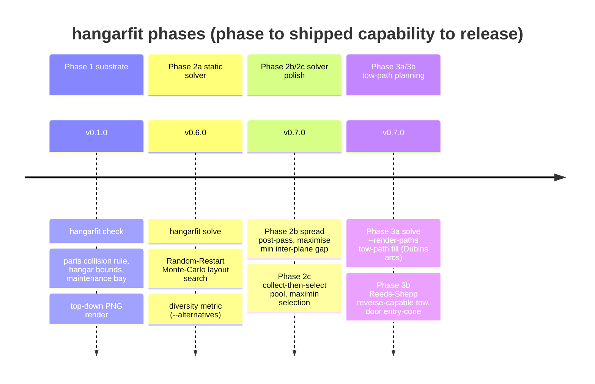

# §1 Introduction & Goals

## What `hangarfit` is

`hangarfit` is an on-demand exception tool for a flying-club hangar. The
club parks nine aircraft in a deep, stack-style hangar with a single door
at the front. A standard parking layout handles the standard day; when
that breaks — a plane returns late, a maintenance slot moves, two aircraft
need to swap order — someone has to come up with an alternative
arrangement on the spot. `hangarfit` checks whether a proposed
arrangement is physically valid (no fuselage/wing/strut collisions, fits
in the hangar, the maintenance plane ends up at the back) and, when
asked, searches for a valid arrangement itself.

It is a CLI tool. It reads YAML, writes JSON and optional top-down PNG
renders, and persists nothing between invocations.

## Shipped phases

Shipped capability by phase, tied to the release it landed in
(authoritative version-to-date mapping in [`CHANGELOG.md`](../../CHANGELOG.md)):

*Phases map to the CLI surface: Phase 1 = `hangarfit check`; Phase 2a/2b/2c
= `hangarfit solve`; Phase 3a/3b = `hangarfit solve --render-paths`. There
were no v0.2.0–v0.5.0 tags — the Phase 2a solver shipped in v0.6.0; the
spread-aware solver (2b/2c) and the full tow-path planner (3a/3b) all shipped
in v0.7.0.*

## Quality goals

In rough order of priority — earlier goals trump later ones when they
conflict.

1. **Correctness of the collision rule.** Every downstream feature
   (`check`, `solve`, the `towplanner`, future planners) sits on top of
   the parts-based collision check. A subtle bug here produces output that *looks*
   plausible but is wrong, which is the worst possible failure mode in
   this domain. The strut-aware golden-test suite in `tests/test_collisions.py`
   is the canary.
2. **Deterministic, reproducible output.** Given the same input and the
   same `--seed`, `hangarfit solve` must produce bit-identical
   `SolveResult` payloads. Without this, no one can debug a layout report
   or diff two runs. Determinism canaries (`tests/test_solver_canaries.py`)
   are intentionally fragile so any unintended drift surfaces in CI.
3. **Readability without a synchronous handover.** The project is
   single-maintainer for now but public, and intended to outlive that
   arrangement. The codebase, this document set, and the ADRs together
   should let an outside reader form a working mental model — and an
   eventual contributor land a useful change — without needing direct
   conversation with the maintainer. This is what "professionalize the
   public repo" cashes out to in practice.
4. **Small-tool ergonomics.** No external services, no database, no
   account, no daemon. Install with `pip`, invoke from a terminal, get an
   answer (and optionally a PNG) in seconds. The tool exists to remove
   friction during an already-stressful situation; it must not add any.
5. **Honesty about uncertainty.** Aircraft and hangar dimensions are
   placeholders until real measurements arrive. The tool says so loudly
   in `data/*.yaml`, in `README.md`, and in CLI output. We do not pretend
   to authoritative answers we cannot deliver yet.

## Stakeholders

| Stakeholder                | Interest in `hangarfit`                                                                                  |
|----------------------------|----------------------------------------------------------------------------------------------------------|
| Club operations lead       | Uses the tool day-of to validate (or find) an exception layout. Wants a clear yes/no and a PNG.          |
| Future contributors        | Read the code and docs to make their first useful change. Want recognizable patterns and a stable scope. |
| Maintainer ([DocGerd](https://github.com/DocGerd)) | Owns the architecture, reviews and merges every PR, and decides what is in scope. |

The club's pilots and the maintenance technician are *consumers* of the
output (they see the proposed layout), but they are not direct users of
the CLI.
