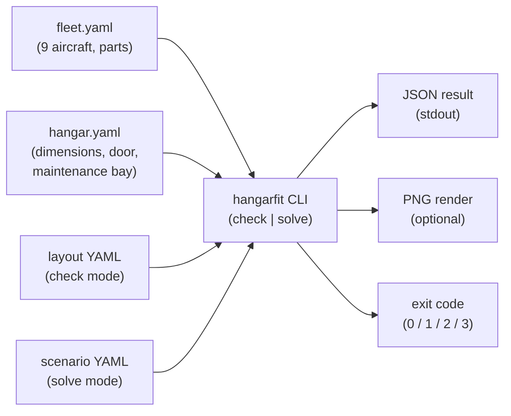

# §3 Context & Scope

## Business context

`hangarfit` lives at the edge of one flying club's hangar operations. On
a normal day, no one needs it: the standard parking plan handles the
fleet returning on schedule. The tool exists for the *exceptions* — when
the standard plan no longer works and someone has to decide, in minutes,
where each aircraft can go.

| External actor | Interaction with `hangarfit` |
|----------------|-------------------------------|
| **Club operations lead** | Invokes the CLI when an exception arises. Hands it a scenario YAML (which planes are present, which one is on maintenance, any forced positions). Reads the JSON status or eyeballs the PNG render to decide whether to use the proposed layout. |
| **Maintenance technician** | Consumer of the result, not a direct user. Cares that the plane scheduled for maintenance ends up at the back of the hangar (the maintenance bay), because that is the curtained-off area where work happens. |
| **Pilots** | Consumers of the result. Care that their plane fits and that they can get it out when they need it. |
| **Future contributors** | Run the tool locally, edit the YAML data files, and contribute fixes/features via PR. |

## Technical context

The tool runs entirely on the user's local machine:

- **Inputs.** YAML files describing the fleet (`data/fleet.yaml`), the
  hangar (`data/hangar.yaml`), and either a candidate layout (for
  `hangarfit check`) or a scenario (for `hangarfit solve`). The fleet
  and hangar YAML are checked into the repo as the source of truth for
  the club's aircraft and building; layout/scenario YAML is authored
  per-invocation.
- **Outputs.** A JSON result on stdout (with `--json`) or a human-readable
  status on stderr, an exit code, and optionally a PNG render via
  `--render`. Exit-code semantics differ between `hangarfit check` and
  `hangarfit solve` (e.g., `solve` reports `1` for both
  "no layout found" and, under `--strict-k`, "fewer than K alternatives
  found", and `3` under `--render-paths` when no candidate is
  tow-routable); the canonical tables live in the root
  [`README.md`](../../README.md#exit-codes-check).
- **No external systems.** The CLI does not call any network service,
  read any database, write to any shared state, or read environment
  variables beyond what Python and `matplotlib` need to find their own
  config.

## Scope — what is in

- **Validating a hand-authored layout** against the collision rule, the
  hangar bounds, and the maintenance-bay rule (`hangarfit check`).
- **Searching for a valid layout** from a scenario specification, under
  hard constraints (`hangarfit solve`).
- **Rendering** the layout top-down so a human can sanity-check the
  geometry, including red overlays on conflicting parts when the layout
  is invalid.

## Scope — what is explicitly *out*

| Out of scope | Why |
|--------------|-----|
| **Movement-sequence planning** — "in what order do I roll planes out and back in to *re-sequence an already-parked* hangar?" | The "Tower of Hanoi" reshuffling of an already-occupied hangar is harder than the static layout problem and was not the original need; re-sequencing parked planes remains a human's job. This is **distinct from the empty-hangar tow-path fill** that *did* ship in Phase 3a/3b — `solve --render-paths` plans how each plane is towed into its slot from the door, one entry per plane ([ADR-0007](../adr/0007-tow-path-planner-v1-scope.md) / [ADR-0010](../adr/0010-reeds-shepp-motion-model.md)). |
| **Tracking hangar state across runs.** | Each invocation is stateless. The scenario YAML carries everything. This is a deliberate constraint from §2; tracking state would invite an entire class of "what was true yesterday?" bugs. |
| **GUI or web frontend.** | A CLI plus a PNG is the right shape for the actual usage (one operator, one decision, no audit trail needed yet). Anything browser-shaped is a separate project. |
| **Live event stream** (late-arrival notifications, departure tracking). | The tool is invoked on demand against a hand-authored scenario. The club uses other tooling (radio, paper, eyeballs) to know who is back; `hangarfit` only checks whether a *proposed* layout is valid. |
| **Soft preferences *inside* the hard conflict-resolution loop** (a weighted "prefer this region" objective competing with collision penalties). | The conflict-resolution loop stays HARD-only (pin, `force_on_carts`, maintenance plane). Soft preferences are not banned outright — they ship as **isolated post-passes** that run only after a layout is already valid (the inter-plane spread post-pass, [ADR-0008](../adr/0008-inter-plane-spread-soft-preference.md)), each with its own ADR, never as a new key in the hard score tuple. |

These boundaries are not "phase 1 limitations to be removed later." They
are deliberate design choices that keep the tool small, correct, and
auditable.
