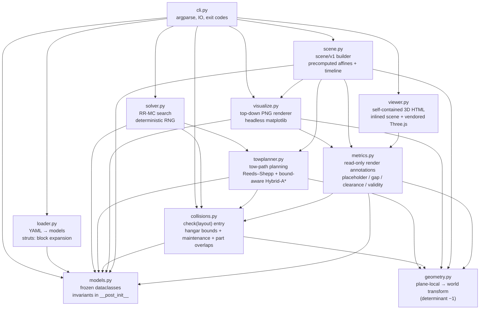
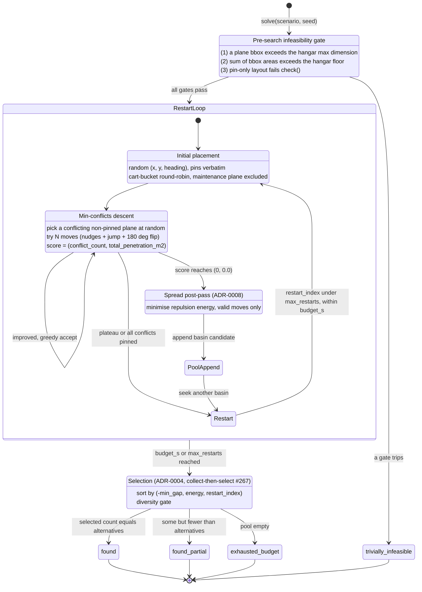

# §5 Building Block View

The system has one level of decomposition: the Python modules under
`src/hangarfit/`. There is no deeper "subsystem" layer — each module is
small and single-purpose by design.

## Level 1: module map

Edges point from caller to callee. `models.py` is the lowest-level
module (no project imports); every other module imports the
dataclasses it consumes from `models.py`, including `cli.py` for
type-annotated returns like `CheckResult` and `SolveResult`. `cli.py`
is the highest module — it orchestrates everything.

## Per-module responsibilities

### `models.py` — data + invariants

Frozen dataclasses for every domain concept: `Part`, `Aircraft`,
`Wheels`, `Hangar`, `MaintenanceBay`, `Placement`, `Layout`, `Conflict`,
`CheckResult`, plus the Phase 2a solver types `Scenario`,
`PlaneConstraint`, `SolveResult`, `SolverDiagnostics`,
`DiversityConfig`, `SearchConfig` and the `SolveStatus` literal.

`Aircraft.wheels` is a **required** `Wheels` block carrying canonical
per-aircraft wheel positions ([ADR-0013](../adr/0013-wheels-canonical-data.md)):
the loader rejects a missing or malformed block, the visualizer draws wheel
glyphs straight from it (no fuselage-fraction heuristics), and the loader
cross-checks each plane's `turn_radius_m` against the canonical wheelbase.

`MaintenanceBay` is a back-anchored partial-width rectangle
(`center_x_m`, `width_m`, `depth_m`) — `Hangar.__post_init__`
enforces that the bay sub-rectangle fits inside the hangar
(`center_x_m ± width_m/2 ∈ [0, hangar.width_m]` and
`depth_m < hangar.length_m`).

`Layout.__post_init__` inverts the Phase 1 maintenance invariant
(updated in [#103](https://github.com/DocGerd/hangarfit/issues/103)):
the bay occupant must **not** appear in `placements` (it is treated as
away). The collision checker and visualizer rely on this invariant —
neither needs to special-case the occupant.

`__post_init__` enforces all invariants that cannot be expressed via
the type system — the cart rule (`movement_mode` ↔ `on_carts`
consistency, at most `hangar.max_carts` cart-eligible planes actually on
carts), the
maintenance-plane-is-in-fleet rule, the
maintenance-plane-is-not-in-placements rule. A constructed instance is
guaranteed structurally valid; nothing downstream re-checks.

`PartKind` is a closed `Literal` set (`"fuselage"`, `"wing"`,
`"strut"`, `"tail"`). The `Conflict.kind` taxonomy is also closed —
adding a new conflict kind is a code change here, not just a string
constant elsewhere.

This module imports nothing from the rest of the project. It is the
project's vocabulary.

### `loader.py` — YAML → models

Parses `fleet.yaml`, `hangar.yaml`, layout YAMLs, and scenario YAMLs
into the dataclasses from `models.py`. The single non-trivial
transformation is the `struts:` block — a high-level YAML shorthand
for strut-braced aircraft that the loader expands into two mirrored
strut `Part`s before constructing the `Aircraft`. The constructed
`Aircraft` has no `struts` field; the parts tuple is the single source
of truth, eliminating any risk of strut volume being double-counted.

Has tests in `tests/test_loader.py` that exercise the `struts:`
expansion end-to-end so the YAML convenience can never silently
desync from the canonical parts representation.

Plane ids are case-sensitive; unknown/mis-cased ids are rejected at load
time with a `did you mean…?` suggestion (see spec
`docs/superpowers/specs/2026-05-25-loader-plane-id-validation-design.md`).

For the `maintenance.plane` field, the loader raises a YAML-author-
actionable `LoaderError` when the named occupant also appears in
`placements`, with the hint "Remove it from placements (or fix the
plane id if it doesn't match an aircraft in the fleet)". The
`Layout.__post_init__` invariant catches the same combination as a
programmatic backstop for callers that construct `Layout` instances
directly.

### `geometry.py` — the determinant −1 transform

Two responsibilities: (1) the plane-local → world transform itself, and
(2) `aircraft_parts_world()`, which applies the transform to every part
of an aircraft at a given `Placement` and returns world-coordinate
polygons.

The transform is the load-bearing det = −1 mapping (see
[ADR-0002](../adr/0002-determinant-minus-one-transform.md)). Tests in
`tests/test_geometry.py` include the 45° canary that catches any
sign-flip regression. PRs touching this file additionally invoke the
`geometry-invariant-guard` review-time subagent.

### `collisions.py` — the heart of Phase 1

`check(layout)` is the public entry point. It runs three independent
predicates and aggregates conflicts:

1. **Hangar bounds** — every part of every placed plane is inside the
   hangar rectangle.
2. **Maintenance bay intrusion** — when `layout.maintenance_plane` is
   set, the bay rectangle is a hard keep-out for every non-occupant
   plane. Any vertex of any non-occupant part that lies strictly
   inside the bay fires a `bay_intrusion` conflict on the owning
   plane (one per offending part). The occupant itself is absent
   from `layout.placements` by `Layout.__post_init__` invariant. See
   [§8 Crosscutting Concepts](08-crosscutting-concepts.md#the-maintenance-bay-rule)
   for the full rule; the decision is recorded in
   [ADR-0006](../adr/0006-bay-intrusion-maintenance-rule.md) (Accepted),
   with [ADR-0005](../adr/0005-maintenance-bay-rule.md) preserved as
   the Superseded Phase 1 predecessor.
3. **Pairwise parts overlap** — across every pair of placed planes,
   every part-pair is tested with the two-clause predicate
   (plan-view distance < `clearance_m` AND height gap <
   `wing_layer_clearance_m`).

The cart rule is **not** here — it is already enforced upstream in
`Layout.__post_init__`. `collisions.py` operates on a structurally
valid `Layout`.

Returns a `CheckResult` with the list of `Conflict`s plus the
`total_penetration_m2` aggregate (added when the Phase 2a solver
landed, as a smooth secondary score that breaks plateaus in the
integer `len(conflicts)` metric).

### `solver.py` — RR-MC layout search

`solve(scenario, budget_s, alternatives, seed)` is the public entry.
Internally:

- **Pre-search infeasibility checks** — three literal-impossibility
  gates fail fast before the search loop runs: (1) a per-plane bbox
  exceeds the hangar's max dimension, (2) the fleet's Σ bbox areas
  exceed the hangar floor, (3) the pin-only Layout (every constrained
  pin, occupant excluded) fails ``check_layout`` — including the case
  where a non-maintenance plane is pinned such that its geometry
  intrudes into the closed bay rectangle (covered by
  ``test_solve_trivially_infeasible_when_pinned_plane_intrudes_into_closed_bay``).
- **Maintenance plane handling** — when `scenario.maintenance_plane` is
  set, the solver drops that plane from the placeable set entirely (no
  initial placement, no perturbation, no cart-bucket slot). The bay
  rectangle is enforced as a hard obstacle by the `bay_intrusion`
  collision rule, so no surrogate sample is needed.
- **Initial placement** — random valid placements respecting pins.
- **Descent step** — min-conflicts perturbation: pick one conflicting
  non-pinned plane *uniformly at random* (over a `sorted()` set, so the
  RNG draw stays deterministic), generate `N` candidate moves for it
  (small nudges + one large jump + one 180° flip) and greedily accept
  the best-scoring one (ties broken by smallest displacement), repeat
  until zero conflicts or a local minimum.
- **Restart cycle** — when descent plateaus, restart with a new random
  placement.
- **Acceptance gate** — every candidate runs through `collisions.check()`
  before counting as accepted.
- **Diversity filter** — post-acceptance, reject candidates that match
  an already-accepted one within the edit-count thresholds (see
  [ADR-0004](../adr/0004-diversity-metric.md)).
- **Termination** — three search outcomes (`found` = K accepted;
  `found_partial` = some-but-fewer-than-K accepted, budget exhausted;
  `exhausted_budget` = zero accepted, budget exhausted) plus the
  pre-search literal `trivially_infeasible` returned before the
  search loop runs at all.
- **Spread post-pass** (`_spread`, `_inter_plane_energy`) — after a layout reaches `(0, 0.0)`, maximizes inter-plane separation by minimizing the repulsion energy `Σ exp(−gap/scale)` while preserving validity. On by default; `--no-spread` / `SearchConfig.spread=False` disables it. See [ADR-0008](../adr/0008-inter-plane-spread-soft-preference.md).
- **Tow-plan bundling** (`plan_paths=True`, default) — each returned layout is tow-planned via `towplanner.plan_fill`, and the result is index-aligned into `SolveResult.plans`. This is **best-effort**: a layout the planner cannot route gets `plans[i] = None` (and is named in `diagnostics.unroutable_planes`) rather than being discarded — the static layout is the answer, the tow plan is advisory. `status` stays search-driven. See the `towplanner.py` entry below and [ADR-0007](../adr/0007-tow-path-planner-v1-scope.md).

The RNG is single-threaded and seeded for bit-identical reproducibility
across runs (compliance check:
`tests/test_solver_canaries.py`). Tow-planning is RNG-free, so the
bundled `(Layout, MovesPlan)` output preserves the same determinism
contract.

The `solve()` lifecycle as a state machine — the pre-search gate, the
restart/descent inner loop, the post-acceptance spread + basin pool, and
the four terminal `SolveStatus` outcomes:

*RR-MC `solve()` state machine: pre-search gate → bounded random-restart
loop (min-conflicts descent, spread post-pass once a layout reaches
`(0, 0.0)`, basin pool) → collect-then-select maximin-gap + diversity
selection → one of four `SolveStatus` outcomes. Sources:
`src/hangarfit/solver.py`, ADR-0003, ADR-0004, ADR-0008.*

### `towplanner.py` — tow-path planning

Answers *how* the planes get to a layout, where `solver.py` answers
*where* they go. Given a target `Layout`, `plan_fill` computes a
collision-free entry **order** (deepest slot first) and a per-plane
**path** from the door-cone entry pose to the target slot, returning a
`MovesPlan` (a tuple of `Move`s, each carrying a `DubinsArc` — the
historical container name; its segments now carry a `gear`). Scope is
the **empty-hangar fill** case — every plane enters once (ADR-0007).

- **Single motion model — Reeds–Shepp** ([ADR-0010](../adr/0010-reeds-shepp-motion-model.md),
  [#261](https://github.com/DocGerd/hangarfit/issues/261)): every plane is
  routed as a closed-form Reeds–Shepp path (Dubins + reverse arcs/straights),
  so it can back up to reorient instead of looping; reverse legs cost 1.5×
  their length so forward is preferred. A cart-borne plane is own-gear with
  `turn_radius_m = 0` (pivot-in-place, plus back-straight-out), via
  `Aircraft.effective_turn_radius_m()`. No two-mode (holonomic/Dubins) branch
  — see §8 *Movement modes*. Supersedes the Dubins-only fork of ADR-0007;
  still closed-form and deterministic.
- **Bound-aware Hybrid-A\*** (`plan_path`, [#222](https://github.com/DocGerd/hangarfit/issues/222))
  — a deterministic search over the six Reeds–Shepp motion primitives
  (forward L/S/R then reverse L/S/R) finds an in-bounds, obstacle-free
  multi-segment path when a single shortest-arc would clip a wall or an
  already-placed plane. Bounded by a node-expansion budget; the full returned
  path is re-validated by the exact `collisions.check`-based oracle
  (`path_first_conflict`).
- **Collision-during-motion** reuses the static checker: each sampled
  pose along an arc is checked against the already-placed subset, so
  parts / hangar-bounds / bay rules are honoured *during* the tow, not
  just at the destination. The front gap at the door is exempt during
  motion (§8 *The door*).
- **Failure is honest** — a layout it cannot route raises
  `NoFeasiblePlanError` naming the offending plane; `solve` records it
  best-effort (see the bundling bullet above), and the CLI's
  `--render-paths` surfaces it (warning + exit code 3, [§6](06-runtime-view.md)) —
  after first attempting the spread-off backstop ([ADR-0016](../adr/0016-spread-towability-fallback.md)).
- **Deterministic** (no RNG): a given `Layout` always yields the same
  `MovesPlan`, preserving [ADR-0003](../adr/0003-rr-mc-solver-algorithm.md)'s
  contract through the bundle.

The module is pure-data + closed-form geometry plus the Hybrid-A\* search;
it imports `models`, `geometry`, and `collisions`, and is imported only
by `solver.py` at runtime (the `MovesPlan` type reference in `cli.py`,
`visualize.py`, and `models.py` is annotation-only, under `TYPE_CHECKING`).

### `visualize.py` — top-down PNG renderer

Renders a layout (with or without a `CheckResult` overlay) to PNG using
matplotlib. Forces a headless backend at import time so the module runs
in CI / pytest without a display server.

The maintenance bay renders conditionally on `layout.maintenance_plane`:
when `None`, the bay area is just normal floor (no overlay); when a
plane is named, the partial-width bay rectangle
(`MaintenanceBay.center_x_m` / `width_m` / `depth_m`) is filled with a
hatched red "wall" style and the label `IN MAINTENANCE: <plane_id>` is
centered inside. The occupant aircraft itself is not drawn — by Layout
invariant it's absent from `placements` and the existing draw loop
skips it without special-casing.

When a `CheckResult` is passed, the renderer validates that every
conflict's referenced planes are in the layout, then overdraws the
conflicting parts in red. The two-layer rendering (base layout in
neutral colors, conflicts in red on top) lets the operator see *what
broke* at a glance.

The render is the only project output that is not also JSON-encodable;
it is the human's sanity-check.

### `scene.py` — `scene/v1` builder (3D)

A pure builder (no I/O, no rendering) that turns a `Layout` (+ optional
`MovesPlan`, `CheckResult`) into the JSON-serializable `hangarfit.scene/v1`
dict consumed by the 3D viewer. It is a leaf consumer of the core types, the
same role `visualize.py` plays for the 2D PNG.

Its defining job is to **own the geometry**: it precomputes the plane-local→world
transform (the determinant −1 map, [ADR-0002](../adr/0002-determinant-minus-one-transform.md))
as per-frame affine matrices and emits `aircraft_parts_world` oracle corners as
`anchors`, so the viewer applies matrices and does no transform math. It also
builds the whole-fill timeline (one segment per plane in `back_first_order`, laid
end-to-end, sampled from each tow `DubinsArc`). Pure and deterministic — same
input ⇒ byte-identical scene. Schema: [`scene-v1-schema.md`](scene-v1-schema.md);
rationale: [ADR-0017](../adr/0017-3d-viewer-architecture.md).

### `viewer.py` — self-contained 3D HTML

Assembles **one** offline HTML file: it inlines the `scene/v1` JSON plus a
`data:`-URL import-map for the vendored Three.js (`_viewer_assets/three/`, shipped
as package data) and the hand-written `_viewer_assets/viewer.js`. The `data:`
import-map sidesteps the ES-module `file://` CORS block so a double-clicked page
loads with zero network. The embedded scene JSON escapes `<` to prevent a
`</script>` breakout. The thin `viewer.js` consumer builds each plane as a
Three.js `Group` driven per-frame by the affine as a `Matrix4` (`DoubleSide` for
the reflected matrix), with an orbit camera and a scrub/play/step timeline, and a
load-time self-check of the affine path against the emitted `anchors`.

### `metrics.py` — read-only render annotations

Pure functions over a `Layout` that annotate (never gate) renders: whether any
placed aircraft is on placeholder/unmeasured data (the "PLACEHOLDER DATA" honesty
banner, #401/#79), the tightest plan-view inter-plane gap, the smallest
wing-over-tail vertical clearance, and `layout_is_valid` (trusts a supplied
`CheckResult`, else runs `collisions.check`) so readouts are shown only for a
verified-valid layout. A leaf consumer used by both `visualize.py` (2D) and
`scene.py` (3D); it never enters the collision model, so it adds no determinism or
correctness risk to the core.

### `cli.py` — argparse dispatch + IO + exit codes

Three subcommands: `hangarfit check` (Phase 1), `hangarfit solve`
(Phase 2a), and `hangarfit view` (Phase 4 — write the 3D HTML viewer,
`cmd_view` → `scene.build_scene` + `viewer.render_viewer`). All are thin
wrappers around the library (`check()` / `solve()` / the scene+viewer
builders); this module owns only argparse, IO routing, and exit-code mapping.

JSON schemas are versioned: `hangarfit.check/v1` and
`hangarfit.solve/v1`. Bumping a version is reserved for breaking
changes to the payload shape; additive fields do not bump. (The
`view` subcommand emits the `hangarfit.scene/v1` JSON *inlined into its
HTML*, not to stdout — see [`scene-v1-schema.md`](scene-v1-schema.md).)

Exit codes:

| Code | `check` | `solve` | `view` |
|------|---------|---------|--------|
| 0 | Valid layout | Found ≥ 1 valid layout (`found` or `found_partial`) | Wrote the viewer HTML (an un-routable layout still succeeds, as a static scene) |
| 1 | Invalid layout (conflicts found) | No valid layout (`exhausted_budget` or `trivially_infeasible`); also `found_partial` with `--strict-k` | `--solve` mode only: solver found no valid layout |
| 2 | Could not check (file not found, bad YAML, invariant violation, IO error during render) | Could not solve (file not found, bad YAML, invariant violation, IO error during render/write) | Could not load (file not found, bad YAML, invariant violation) or write the HTML (`OSError`); missing `-o` (argparse) |

## Module-level invariants

Three invariants hold across the whole substrate:

1. **`models.py` imports nothing from the rest of the project.** Other
   modules import *from* `models.py`. This means data definitions
   cannot depend on geometry, collision, solver, or rendering logic —
   the vocabulary stays independent.
2. **`check(layout)` is the only acceptance gate.** The solver does
   not bypass it; the CLI does not bypass it; the visualizer does not
   bypass it. A `Layout` that `check()` accepts is *the* definition of
   "valid layout."
3. **`solver.py` is single-threaded.** Reproducibility is achieved by
   threading a seeded RNG through every randomized step; parallelism
   would compromise that.

Each invariant is enforced by code review rather than by mechanical
check; each has a corresponding test or subagent that catches the
common ways it could be broken.

## What this view does *not* show

- **Data formats on disk.** The YAML schemas for `fleet.yaml`,
  `hangar.yaml`, layout YAMLs, and scenario YAMLs are documented in
  the file headers and exercised by `tests/fixtures/*.yaml` examples.
- **Runtime sequences.** See [§6 Runtime View](06-runtime-view.md).
- **Crosscutting domain rules** (the parts model itself, the
  coordinate convention, default clearances, testing posture). See
  [§8 Crosscutting Concepts](08-crosscutting-concepts.md).
