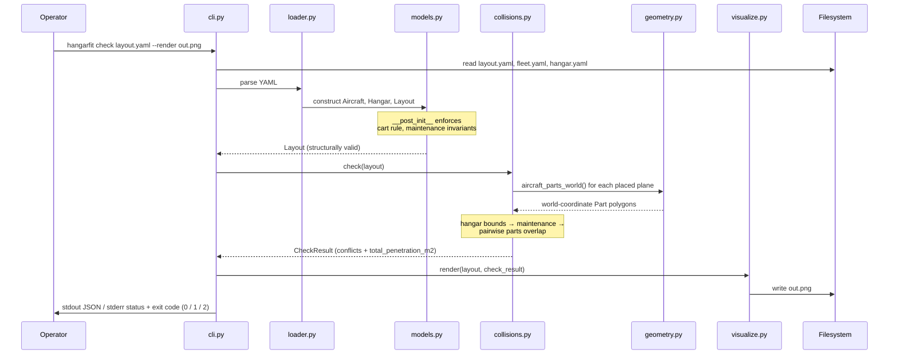
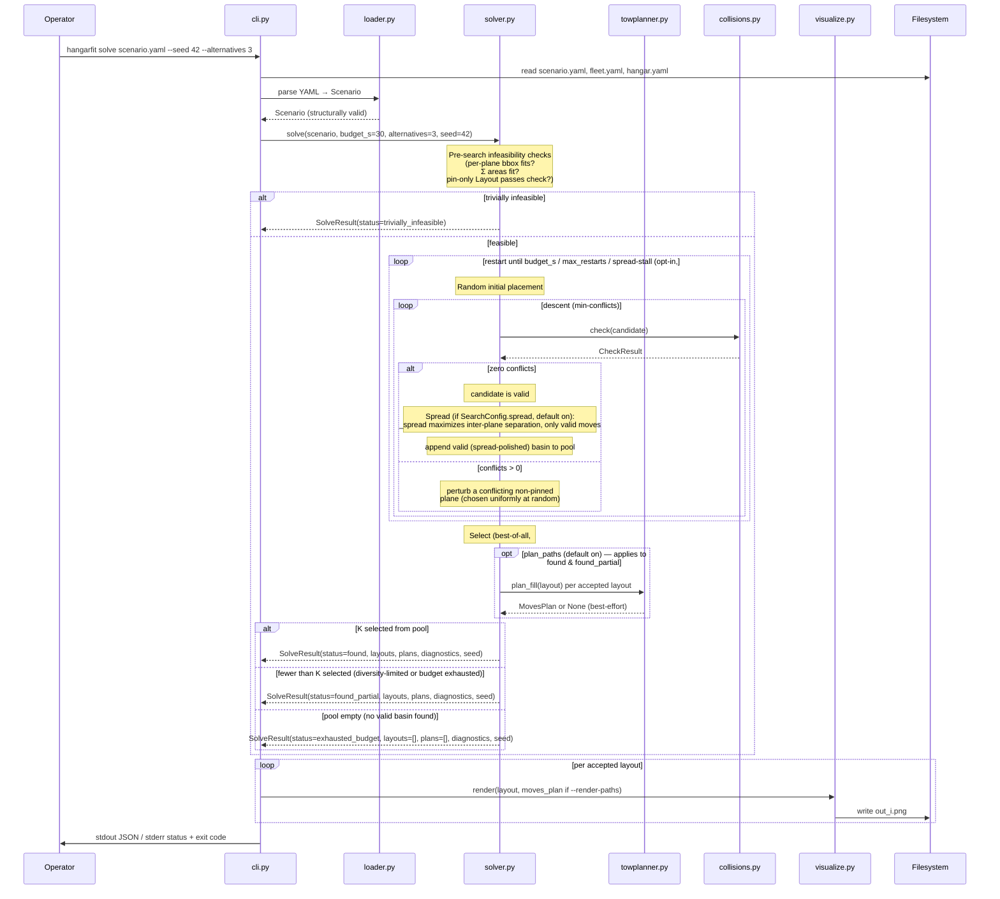
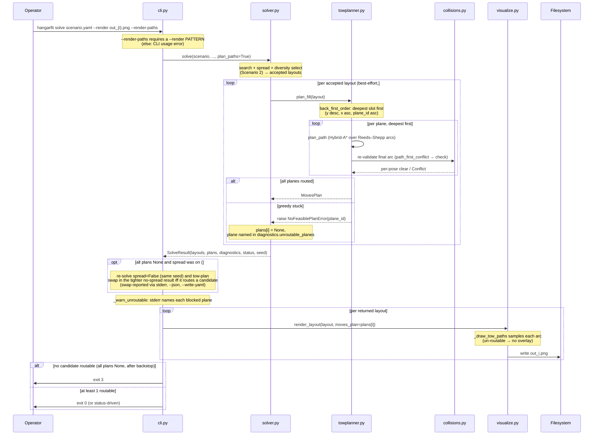

# §6 Runtime View

Four scenarios cover the operational use of `hangarfit`: validating a
candidate layout (`hangarfit check`), searching for a valid layout
(`hangarfit solve`), the `--render-paths` tow-overlay zoom-in, and writing
the interactive 3D viewer (`hangarfit view`). All are short-lived CLI
invocations — there is no daemon, no long-running process, no stateful session.

## Scenario 1: `hangarfit check examples/layouts/example.yaml --render out.png`

The Phase 1 acceptance path. The operator has a candidate layout YAML
and wants a yes/no plus a visual.

The flow is strictly linear — there are no loops, no retries, no
parallelism. The same input produces the same output deterministically.

**Failure modes:**

- File-not-found, bad YAML, or invariant violation → exit code 2; the
  CLI prints a structured error and does not write a PNG.
- Layout structurally valid but geometrically invalid (`check()`
  returns conflicts) → exit code 1; the PNG (if requested) is still
  written, with conflicting parts overdrawn in red. This is on
  purpose: the operator wants the visual *especially* when the layout
  is broken.
- Everything OK → exit code 0; the PNG (if requested) shows the layout
  in neutral colors with no red overlay.

## Scenario 2: `hangarfit solve scenario.yaml --seed 42 --alternatives 3 --render out_{i}.png`

The Phase 2a path. The operator has a scenario (fleet, hangar,
constraints, optional pins) and wants the tool to find up to K
diverse valid layouts.

**Spread (if `SearchConfig.spread`, default on):** the valid placements are refined by `_spread` to maximize inter-plane separation (minimize `Σ exp(−gap/scale)`), accepting only moves that stay valid. The spread layout is what proceeds to the diversity filter. See [ADR-0008](../adr/0008-inter-plane-spread-soft-preference.md).

**Tow-plan bundle (if `plan_paths`, default on):** before returning, `solve` tow-plans each accepted layout via `towplanner.plan_fill`, producing `SolveResult.plans` index-aligned with `layouts` — the bundled `(Layout, MovesPlan)` output. This is **best-effort**: a layout the v1 planner cannot route gets `plans[i] = None` (the blocking plane recorded in `diagnostics.unroutable_planes`) rather than being dropped, so `status` stays search-driven (ADR-0007 / [§8 *Movement modes*](08-crosscutting-concepts.md)). The CLI computes the bundle only under `--render-paths` (it overlays each path on the PNG, and exits 3 if no candidate is routable — see the exit-code note below); a plain `solve` invocation passes `plan_paths=False` and pays no planning cost. Tow-planning is RNG-free, so the bundle is bit-identical across runs for a seed.

**Determinism.** Given the same scenario, the same `--seed`, and the
same project version (same `hangarfit.solve/v1` schema), the returned
`SolveResult` is bit-identical across runs. This is the
load-bearing contract behind quality goal #2; the determinism canaries
in `tests/test_solver_canaries.py` are the regression guard.

**Termination statuses.** The solver returns one of four
`SolveStatus` literals — three from the search loop and one from
the pre-search infeasibility check:

| Status | Meaning | Exit code (without `--strict-k`) |
|--------|---------|-----------------------------------|
| `found` | K solutions accepted | 0 |
| `found_partial` | 1 ≤ N < K accepted, budget exhausted | 0 |
| `exhausted_budget` | 0 accepted, budget exhausted | 1 |
| `trivially_infeasible` | Pre-search check failed | 1 |

With `--strict-k`, `found_partial` also returns exit code 1 — useful
for scripted invocation where "fewer than K alternatives" should be
treated as failure.

**Exit code 3 — `--render-paths` tow-routability (#193).** Exit code is
not solely a function of `SolveStatus`. When `--render-paths` is set the
CLI tow-plans every returned layout (the bundled `(Layout, MovesPlan)`
of `solve()`, ADR-0007) and renders the path overlay. Because the v1
planner has documented false-negatives, an un-routable layout is *kept*
(best-effort, #197) and rendered without paths. If **no** returned
candidate is tow-routable, the CLI exits **3** — distinct from exit 1
(no layout at all), since a valid static layout was still found and
rendered. If at least one candidate is routable the exit code stays 0
(each un-routable one emits a stderr warning naming the blocked plane).
Exit 3 is checked before the `--strict-k` exit-1 rule. Without
`--render-paths` the CLI does not tow-plan, so tow-routability never
affects the exit code.

**Spread-vs-towability fallback (#280, [ADR-0016](../adr/0016-spread-towability-fallback.md)).**
Before that exit 3 is returned, one backstop runs: if spread was *not*
explicitly disabled and **every** plan came back un-routable, the CLI
re-solves once with `spread=False` (reusing the same resolved seed) and,
*only if that re-solve actually routes a candidate*, renders the tighter
no-spread arrangement instead — reporting the swap on stderr, in
`--json` (`diagnostics.spread_fallback_applied`), and as a `--write-yaml`
provenance comment. If the no-spread re-solve also routes nothing
(genuinely too tight — e.g. the placeholder hangar), the original spread
result is kept and exit 3 stands. The *primary* reason default layouts
are routable in the first place is the back-of-hangar fill bias
([#320](https://github.com/DocGerd/hangarfit/issues/320), the 2026-06-01
amendment to [ADR-0008](../adr/0008-inter-plane-spread-soft-preference.md));
this fallback is the backstop for when placement is not enough.

**No retries inside solve().** The solver does not retry on a single
candidate's failure — it just restarts. There is no exception path
from `check()` into the solver other than structural failure (which
would indicate a bug in the random-placement generator), and that
bubbles up as exit code 2.

## Scenario 3: `hangarfit solve scenario.yaml --render out_{i}.png --render-paths`

The Phase 3a/3b path — a zoom-in on the `opt plan_paths` step that
Scenario 2 abstracts as a single call. The operator wants the solver's
layouts *plus* a per-plane tow path overlaid on each PNG; `--render-paths`
turns on the best-effort tow bundle and the exit-3 routability check.

*Scenario 3 — `solve --render-paths`: `solve(plan_paths=True)` tow-plans each accepted layout via `plan_fill` (back-first order; per-plane Hybrid-A\* over Reeds–Shepp arcs, the final arc re-validated by `collisions.check`). Routing is best-effort — a layout the bounded planner can't route keeps `plans[i]=None` and the blocked plane is recorded in `diagnostics.unroutable_planes` rather than dropping the valid static layout. The CLI overlays each routable path and exits 3 only when no returned candidate is tow-routable (#193/#197, ADR-0007/ADR-0010).*

## Scenario 4: `hangarfit view layout.yaml -o out.html`

The Phase 4 / v0.10.0 path. The operator wants a self-contained, offline 3D
HTML view of a candidate layout — with the whole-fill tow animation when the
layout is tow-routable. In layout mode the CLI best-effort tow-plans the layout
to drive the animation, but caps the **global** fill budget at a small
deterministic expansion count (`_VIEW_TOW_MAX_TOTAL_EXPANSIONS = 300`, #398) so
an un-routable layout (e.g. the default `examples/layouts/example.yaml`) degrades to a
**static** 3D render in a few seconds instead of grinding through the full
disprove budget (~2 min). This is a deterministic expansion-count cap, **not** a
wall-clock deadline ([ADR-0003](../adr/0003-rr-mc-solver-algorithm.md));
`--tow-max-expansions` overrides it. On a `NoFeasiblePlanError` the CLI prints a
`note:` to stderr and proceeds; `scene.build_scene` then emits empty `timeline`
segments and the viewer disables transport. `cmd_view` calls
`scene.build_scene` → `viewer.render_viewer` and writes the HTML; exit 0 even
for an un-routable (static) layout, exit 2 on a load/write error, and — in
`--solve` mode only — exit 1 when the solver finds no valid layout. `--no-animate`
skips tow planning entirely; `view --solve` solves a scenario first and routes
via `solve()`, unaffected by this global cap. In layout mode the render never
touches the solver's seeded path — it goes through `metrics` only for the
placeholder banner and readouts — so the scene is byte-identical for a given
input layout; under `--solve`, reproducibility is the solver's usual same-seed
contract.

## What is *not* a runtime concern

- **Long-running state.** Each invocation is stateless. There is no
  session, no checkpoint, no incremental rerun. The scenario YAML
  carries everything the tool needs.
- **Concurrent solves.** The CLI runs one solve at a time per process.
  Two simultaneous `hangarfit solve` invocations against different
  scenarios are independent processes; they do not share state.
- **Asynchronous notifications.** The tool does not push results
  anywhere — the operator reads stdout / stderr / the PNG on disk.
  Integration with anything event-driven would be a wrapper script's
  job, not the tool's.

For the static decomposition the runtime view sits on top of, see
[§5 Building Block View](05-building-block-view.md).
For the *why* behind any of the load-bearing runtime choices (RR-MC
vs alternatives, diversity filter, three-way termination), see
[the ADRs](../adr/).
