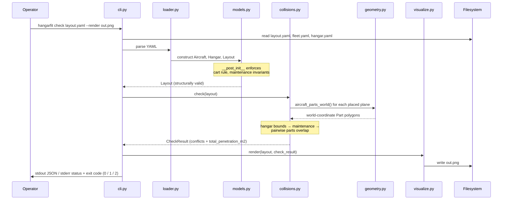
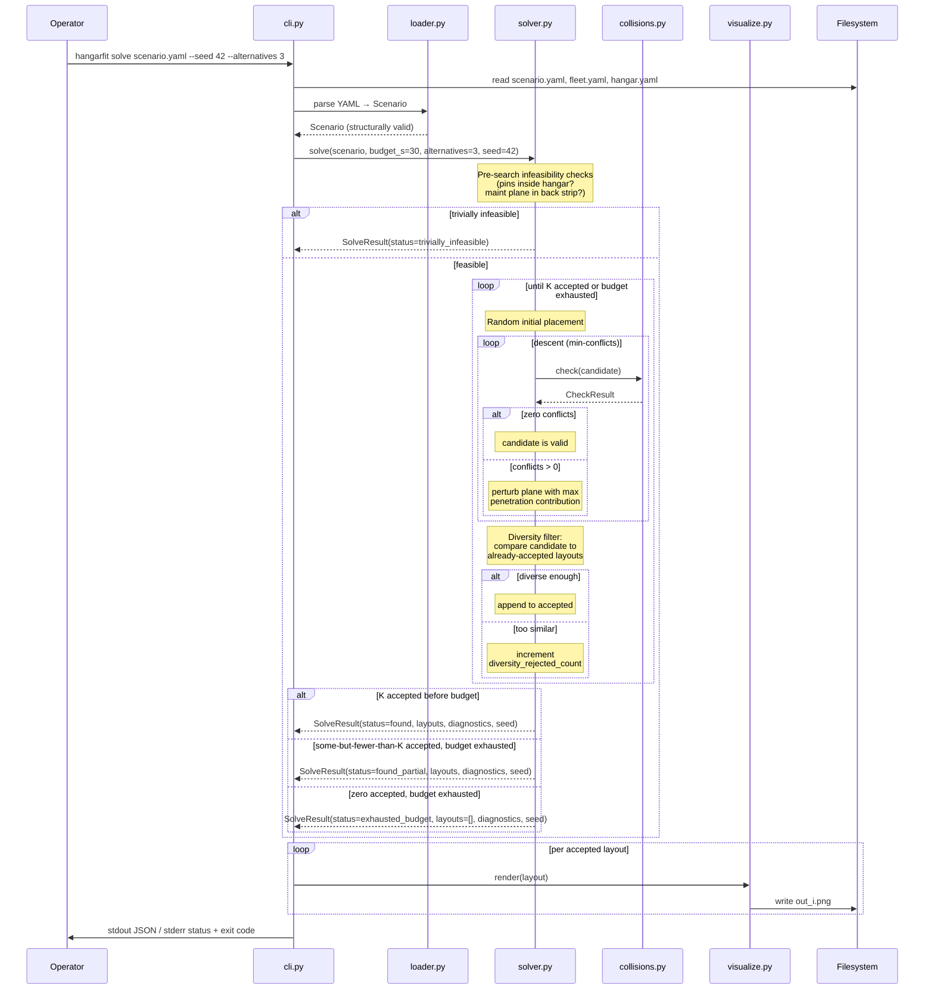

# §6 Runtime View

Two scenarios cover the operational use of `hangarfit`: validating a
candidate layout (`hangarfit check`) and searching for a valid layout
(`hangarfit solve`). Both are short-lived CLI invocations — there is
no daemon, no long-running process, no stateful session.

## Scenario 1: `hangarfit check layouts/example.yaml --render out.png`

The Phase 1 acceptance path. The operator has a candidate layout YAML
and wants a yes/no plus a visual.

The flow is strictly linear — there are no loops, no retries, no
parallelism. The same input produces the same output deterministically.

**Failure modes:**

- File-not-found, bad YAML, or invariant violation → exit code 2; the
  CLI prints a structured error and does not write a PNG.
- Layout structurally valid but geometrically invalid (`check()`
  returns conflicts) → exit code 1; the PNG (if requested) is still
  written, with conflicting parts overdrawn in red. This is on
  purpose: the operator wants the visual *especially* when the layout
  is broken.
- Everything OK → exit code 0; the PNG (if requested) shows the layout
  in neutral colors with no red overlay.

## Scenario 2: `hangarfit solve scenario.yaml --seed 42 --alternatives 3 --render out_{i}.png`

The Phase 2a path. The operator has a scenario (fleet, hangar,
constraints, optional pins) and wants the tool to find up to K
diverse valid layouts.

**Determinism.** Given the same scenario, the same `--seed`, and the
same project version (same `hangarfit.solve/v1` schema), the returned
`SolveResult` is bit-identical across runs. This is the
load-bearing contract behind quality goal #2; the determinism canaries
in `tests/test_solver_canaries.py` are the regression guard.

**Termination statuses.** The solver returns one of four
`SolveStatus` literals — three from the search loop and one from
the pre-search infeasibility check:

| Status | Meaning | Exit code (without `--strict-k`) |
|--------|---------|-----------------------------------|
| `found` | K solutions accepted | 0 |
| `found_partial` | 1 ≤ N < K accepted, budget exhausted | 0 |
| `exhausted_budget` | 0 accepted, budget exhausted | 1 |
| `trivially_infeasible` | Pre-search check failed | 1 |

With `--strict-k`, `found_partial` also returns exit code 1 — useful
for scripted invocation where "fewer than K alternatives" should be
treated as failure.

**No retries inside solve().** The solver does not retry on a single
candidate's failure — it just restarts. There is no exception path
from `check()` into the solver other than structural failure (which
would indicate a bug in the random-placement generator), and that
bubbles up as exit code 2.

## What is *not* a runtime concern

- **Long-running state.** Each invocation is stateless. There is no
  session, no checkpoint, no incremental rerun. The scenario YAML
  carries everything the tool needs.
- **Concurrent solves.** The CLI runs one solve at a time per process.
  Two simultaneous `hangarfit solve` invocations against different
  scenarios are independent processes; they do not share state.
- **Asynchronous notifications.** The tool does not push results
  anywhere — the operator reads stdout / stderr / the PNG on disk.
  Integration with anything event-driven would be a wrapper script's
  job, not the tool's.

For the static decomposition the runtime view sits on top of, see
[§5 Building Block View](05-building-block-view.md).
For the *why* behind any of the load-bearing runtime choices (RR-MC
vs alternatives, diversity filter, three-way termination), see
[the ADRs](../adr/).
